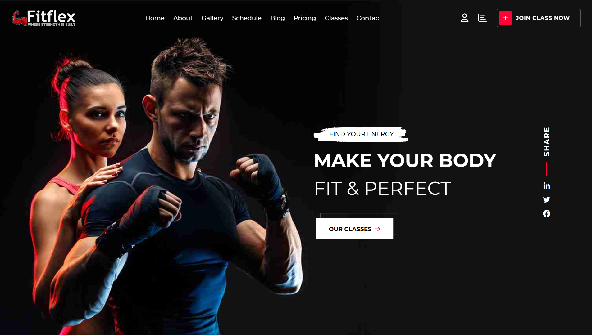
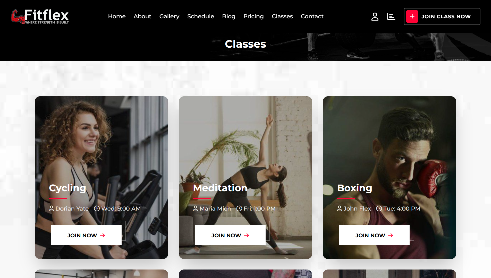
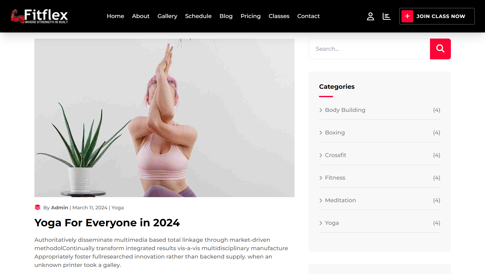
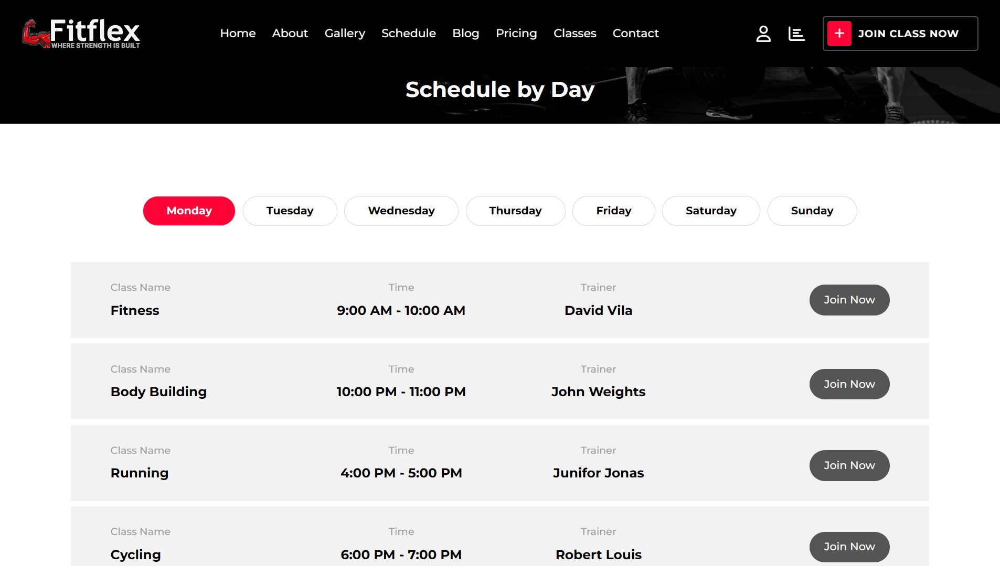
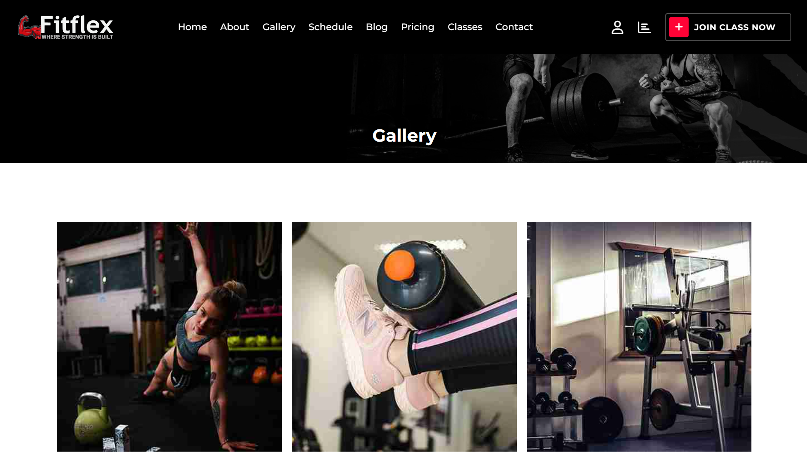
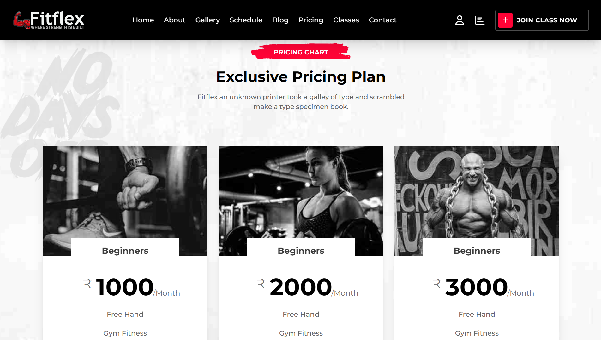
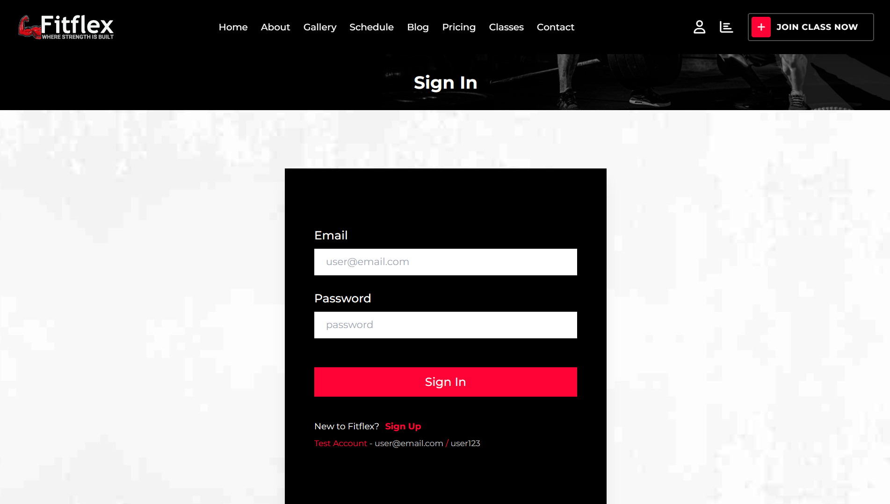
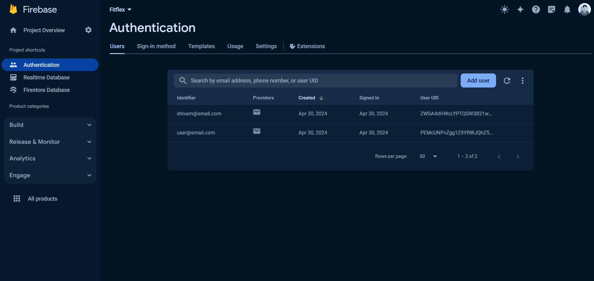

<div align='center'></div>

## Project Overview

This application is designed to streamline gym operations and enhance member experience. Leveraging React.js, Tailwind CSS, and Firebase for authentication, our system offers a comprehensive solution for managing various aspects of a gym, including scheduling, pricing, classes, and more. With an intuitive user interface and robust features, our app to optimize gym management while providing a seamless experience for members.

<h3>Build with:</h3>

[](https://skillicons.dev)

- [Demo](#demo)
- [Features](#features)
- [Getting Started](#getting-started)
- [Screenshots](#screenshots-of-the-project-)
- [Contributing](#contributing)

<br>

## Demo

👉 Experience Fitflex Gym live by visiting our demo: <a href='https://fitflex-gym.vercel.app/'> Fitflex Demo</a>

<br>

## Features

- **User Authentication:** Utilize Firebase authentication for secure user authentication and management.

- **Responsive Design:** Enjoy a responsive design tailored for various devices, ensuring accessibility and usability.

- **Page Navigation:** Navigate seamlessly between pages, including Home, About, Gallery, Schedule, Blog, Pricing, Classes, and Contact.

- **Dynamic Content:** Access dynamic content for each page, providing up-to-date information for users.

- **Interactive Elements:** Engage with interactive elements for enhanced user experience and functionality.

<br>

## Getting Started

Follow these steps to set up My Chat App locally on your machine:

1. Clone the repository:

   ```bash
   git clone https://github.com/I-ShivamSingh/Fitflex.git
   ```

2. Install project dependencies:

   ```bash
   cd My-Chat-App
   npm install
   ```

3. Start the development server:

   ```bash
   npm start
   ```

4. Visit `http://localhost:3000` in your web browser to access the application.

<br>

## Screenshots of the Project 📸

<br>
<h3 align='center'>Home Page 🏡</h3>

<div align='center'>


</div>

<br><br>
<h3 align='center'>Classes Page 👇</h3>

<div align='center'>

</div>
<br>
<br>
<h3 align='center'>Blog Page 👇</h3>

<div align='center'>

</div>
<br>
<br>
<h3 align='center'>Schedule Page 👇</h3>

<div align='center'>

</div>
<br>
<br>
<h3 align='center'>Contact Page 👇</h3>

<div align='center'>

</div>
<br>
<br>
<h3 align='center'>Gallery Page 👇</h3>

<div align='center'>

</div>
<br>
<br>
<h3 align='center'>Pricing Page 👇</h3>

<div align='center'>

</div>
<br>
<br>
<h3 align='center'>Login Page 👇</h3>

<div align='center'>

</div>
<br>
<br>
<h3 align='center'>Firebase Authentication 👇</h3>

<div align='center'>

</div>
<br>
<br>
<h3 align='center'>About Page 👇</h3>

<div align='center'>

</div>
<br>


## Contributing

We welcome contributions from the community. To contribute to My Chat App, follow these steps:

1. Fork the repository.

2. Create a new branch for your feature or bug fix:

   ```bash
   git checkout -b feature/your-feature
   ```

3. Make your changes and commit them:

   ```bash
   git commit -m "Add your feature"
   ```

4. Push your changes to your fork:

   ```bash
   git push origin feature/your-feature
   ```

5. Create a pull request to the `main` branch of this repository.
